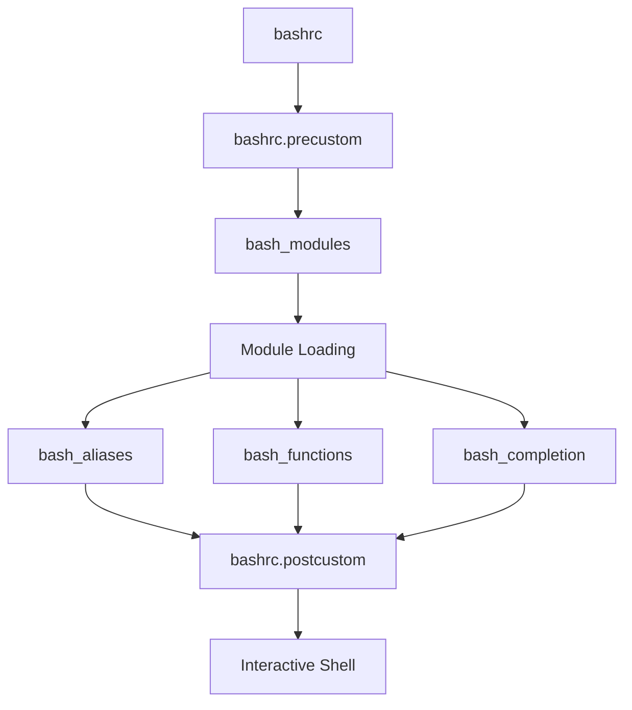
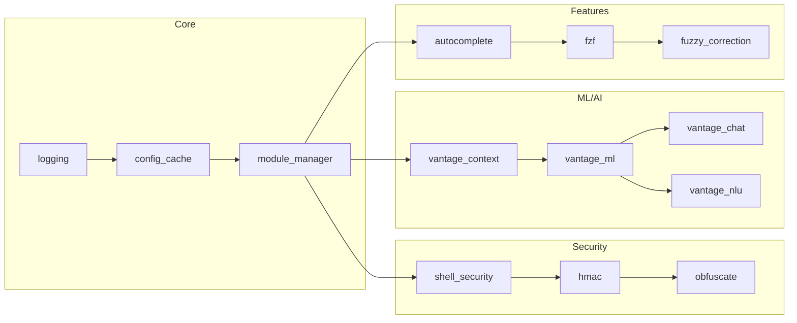
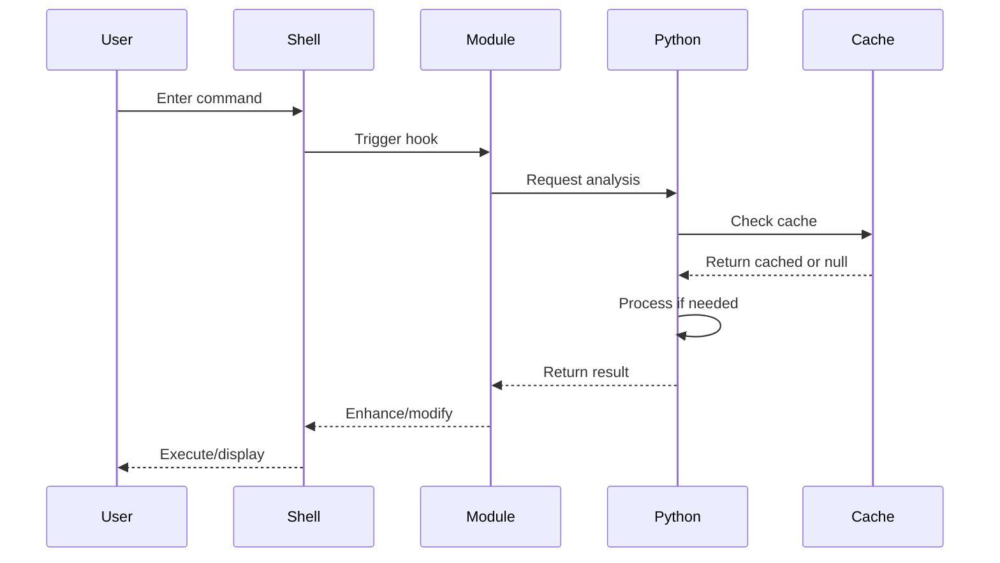

# VANTAGE Dependencies and Component Relationships

## Overview

This document maps out all dependencies within VANTAGE, including module dependencies, Python package requirements, system dependencies, and the relationships between different components. Understanding these relationships is crucial for maintenance, debugging, and extending VANTAGE.

## Dependency Categories

### 1. System Dependencies

#### Core Requirements
```
bash (>= 4.4)
├── associative arrays
├── command substitution
└── extended globbing

python3 (>= 3.8)
├── venv module
├── pip
└── development headers

git (>= 2.0)
├── submodules support
└── sparse checkout
```

#### Optional System Tools
```
Enhanced Features:
├── fzf                 # Fuzzy finding
├── ripgrep (rg)       # Fast searching
├── jq                 # JSON processing
├── yq                 # YAML processing
└── tmux               # Terminal multiplexing

Security Tools:
├── nmap               # Network scanning
├── hashcat            # Password cracking
├── john               # Password cracking
└── aircrack-ng        # Wireless security
└── metasploit         # Exploitation framework

Development Tools:
├── distcc             # Distributed compilation
├── ccache             # Compilation cache
├── docker             # Containerization
└── podman             # Alternative container runtime
```

### 2. Python Dependencies

#### Core Python Packages
```
requirements.txt:
├── Core ML/AI
│   ├── numpy>=1.21.0
│   ├── scikit-learn>=1.0.0
│   ├── torch>=1.13.0
│   └── transformers>=4.25.0
│
├── NLP/Text Processing
│   ├── nltk>=3.8
│   ├── spacy>=3.4.0
│   ├── textblob>=0.17.0
│   └── gensim>=4.2.0
│
├── Data Processing
│   ├── pandas>=1.5.0
│   ├── polars>=0.15.0
│   └── dask>=2022.12.0
│
├── UI/TUI
│   ├── rich>=12.6.0
│   ├── textual>=0.10.0
│   ├── click>=8.1.0
│   └── typer>=0.7.0
│
├── Networking/OSINT
│   ├── requests>=2.28.0
│   ├── aiohttp>=3.8.0
│   ├── beautifulsoup4>=4.11.0
│   ├── scrapy>=2.7.0
│   └── shodan>=1.28.0
│
└── Utilities
    ├── pyyaml>=6.0
    ├── python-dotenv>=0.21.0
    ├── watchdog>=2.2.0
    └── schedule>=1.1.0
```

### 3. Module Dependencies

#### Core Module Dependency Graph
```
module_manager.module
├── config_cache.module
├── logging.module
└── shell_security.module

autocomplete.module
├── fzf.module
└── fuzzy_correction.module

vantage_ml.module
├── logging.module
├── config_cache.module
└── vantage_context.module

vantage_chat.module
├── vantage_ml.module
├── vantage_context.module
└── vantage_nlu.module

vantage_osint.module
├── logging.module
├── config_cache.module
└── vantage_gitstar.module
```

#### Module Initialization Order
```
Level 0 (No Dependencies):
- logging.module
- config_cache.module
- shell_security.module
- hmac.module

Level 1 (Basic Dependencies):
- module_manager.module
- path_manager.module
- distcc.module
- hashcat.module

Level 2 (Feature Modules):
- autocomplete.module
- fzf.module
- fuzzy_correction.module
- vantage_context.module

Level 3 (Advanced Features):
- vantage_ml.module
- vantage_nlu.module
- project_suggestions.module

Level 4 (Integration Modules):
- vantage_chat.module
- vantage_osint.module
- vantage_cybersec_ml.module
```

## Component Relationships

### 1. Bash Components



### 2. Module Interactions



### 3. Python Component Integration

```python
# Component dependency tree
vantage_base
├── vantage_context
│   ├── uses: system state, git info, directory analysis
│   └── provides: context objects
│
├── vantage_autolearn
│   ├── uses: context, command history
│   └── provides: learning updates
│
├── vantage_suggest
│   ├── uses: context, autolearn data, ML models
│   └── provides: command suggestions
│
├── vantage_nlu
│   ├── uses: NLP models, context
│   └── provides: intent understanding
│
├── vantage_chat
│   ├── uses: LLM models, context, NLU
│   └── provides: conversational interface
│
├── vantage_cybersec_ml
│   ├── uses: security models, context
│   └── provides: threat detection, recommendations
│
└── vantage_osint
    ├── uses: web APIs, scrapers, context
    └── provides: intelligence data
```

### 4. Data Flow Relationships



## Configuration Dependencies

### 1. Configuration Cascade

```yaml
# Default configuration (built into modules)
defaults:
  timeout: 30
  cache_size: 1000

# System configuration (/etc/vantage/config.yaml)
system:
  overrides:
    timeout: 60

# User configuration (~/.vantage/config.yaml)
user:
  overrides:
    cache_size: 5000

# Environment variables
VANTAGE_TIMEOUT=120

# Final effective configuration:
# timeout: 120 (from env var)
# cache_size: 5000 (from user config)
```

### 2. Module Configuration Dependencies

```bash
# Module A configuration
MODULE_A_ENABLED=true
MODULE_A_CACHE_DIR="$HOME/.cache/module_a"

# Module B depends on Module A's cache
MODULE_B_SOURCE="$MODULE_A_CACHE_DIR/processed"

# Module C uses both
MODULE_C_INPUTS="$MODULE_A_CACHE_DIR:$MODULE_B_SOURCE"
```

## File System Dependencies

### 1. Directory Structure Requirements

```
$HOME/
├── .vantage/                    # User configuration
│   ├── config.yaml              # Main config
│   ├── modules/                 # User modules
│   └── data/                    # User data
│
├── .cache/vantage/             # Cache directory
│   ├── ml_models/               # Cached ML models
│   ├── completions/             # Completion cache
│   └── osint/                   # OSINT data cache
│
└── .local/share/vantage/       # Data directory
    ├── logs/                    # Log files
    ├── history/                 # Command history
    └── learned/                 # Learned patterns
```

### 2. File Dependencies

```
Module File Dependencies:
├── bash_modules (requires)
│   ├── bash_modules.d/*.module
│   └── config/module_registry
│
├── Python components (require)
│   ├── contrib/__init__.py
│   ├── contrib/vantage_base.py
│   └── requirements.txt
│
└── GitStar system (requires)
    ├── gitstar/categories.json
    ├── gitstar/repo_data.json
    └── gitstar/readmes/
```

## Runtime Dependencies

### 1. Process Dependencies

```
VANTAGE Shell Session
├── Bash Process (main)
│   ├── Module Processes
│   └── Completion Process
│
├── Python Processes
│   ├── ML Model Server (optional)
│   ├── Chat Server (when active)
│   └── OSINT Workers (on demand)
│
└── Background Services
    ├── Cache Manager
    ├── Log Rotator
    └── Update Checker
```

### 2. Network Dependencies

```
External Services:
├── LLM Providers
│   ├── Ollama (localhost:11434)
│   ├── OpenAI API (optional)
│   └── Custom endpoints
│
├── OSINT Sources
│   ├── GitHub API
│   ├── Shodan API
│   ├── VirusTotal API
│   └── Custom sources
│
└── Update Services
    ├── GitHub releases
    └── Package repositories
```

## Dependency Resolution

### 1. Module Dependency Resolution

```python
def resolve_module_dependencies(modules):
    """Topological sort of module dependencies"""
    graph = build_dependency_graph(modules)
    
    visited = set()
    stack = []
    
    def visit(module):
        if module in visited:
            return
        visited.add(module)
        
        for dep in graph[module]:
            visit(dep)
        
        stack.append(module)
    
    for module in modules:
        visit(module)
    
    return stack[::-1]  # Reverse for load order
```

### 2. Python Package Resolution

```bash
# Install with dependency resolution
pip install -r requirements.txt --upgrade-strategy eager

# Check for conflicts
pip check

# Generate lock file
pip freeze > requirements.lock
```

## Troubleshooting Dependencies

### 1. Missing System Dependencies

```bash
# Check system dependencies
vantage check-deps

# Install missing dependencies
vantage install-deps

# Manual verification
for cmd in bash python3 git fzf rg; do
    command -v $cmd >/dev/null || echo "Missing: $cmd"
done
```

### 2. Module Dependency Issues

```bash
# Debug module dependencies
export VANTAGE_MODULE_DEBUG=1
vantage module deps <module_name>

# Force reload modules
vantage module reload --force

# Check circular dependencies
vantage module check-circular
```

### 3. Python Dependency Conflicts

```bash
# Create fresh environment
python3 -m venv ~/.vantage/venv_test
source ~/.vantage/venv_test/bin/activate

# Test installation
pip install -r requirements.txt

# Compare with current
pip freeze | diff requirements.lock -
```

## Best Practices

### 1. Dependency Management

- **Minimize Dependencies**: Only add necessary dependencies
- **Version Pinning**: Pin versions for stability
- **Regular Updates**: Keep dependencies updated
- **Conflict Avoidance**: Test new dependencies thoroughly

### 2. Module Development

- **Declare All Dependencies**: Be explicit in module headers
- **Check Availability**: Verify optional dependencies
- **Graceful Degradation**: Handle missing dependencies
- **Document Requirements**: Clear documentation

### 3. System Integration

- **Path Management**: Use absolute paths
- **Environment Isolation**: Don't pollute global environment
- **Resource Limits**: Respect system resources
- **Clean Shutdown**: Proper cleanup on exit

## Dependency Visualization Tools

### Generate Dependency Graphs

```bash
# Module dependencies
vantage module graph --output module_deps.png

# Python dependencies
pipdeptree --graph-output png > python_deps.png

# System dependencies
vantage deps visualize --output system_deps.png
```

### Analyze Dependencies

```bash
# Find unused dependencies
vantage deps unused

# Check for updates
vantage deps outdated

# Security audit
vantage deps audit
```

## Conclusion

Understanding VANTAGE's dependencies and component relationships is essential for:
- Troubleshooting issues
- Adding new features
- Optimizing performance
- Maintaining security

The modular architecture with clear dependencies enables flexible deployment while maintaining system integrity.